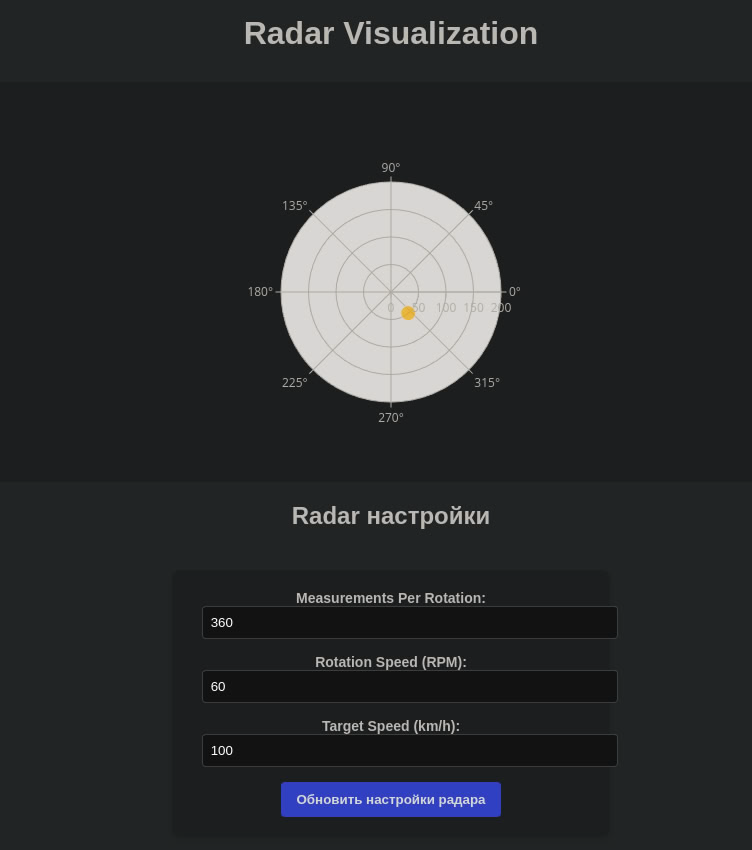

# Radar Display
Completed

## Project Overview
Radar Target Display is a web-based application designed to visualize radar measurements in real-time. It connects to a radar emulation service via WebSocket, processes incoming data, and dynamically displays the detected targets on a polar chart. The system allows for adjusting radar settings through an intuitive user interface and updates the chart as new data is received.


## Features

- **Dynamic Radar Target Display**:  
  The application visualizes radar data by plotting detected targets on a polar chart, automatically refreshing the chart as new measurements are received from the radar service.

- **Real-time Data Stream**:  
  Through a WebSocket connection, the system continuously receives radar data, which is processed and displayed on the chart without delays, providing a live overview of the radar's environment.

- **Customizable Radar Settings**:  
  Users can modify radar parameters such as the number of measurements per rotation, the speed of rotation, and the target speed. These updates are sent to the radar service via an API for immediate effect.

- **Signal Strength Visualization**:  
  Targets are shown with color-coded markers that indicate their signal strength. High-power targets are marked in red, medium power in orange, and low-power targets in green. Additionally, the size of each target varies according to its strength.

## How to Run

### 1. Set up the Radar Emulation Service
To simulate the radar data, run the radar emulation service using Docker:

```bash
docker pull iperekrestov/university:radar-emulation-service
docker run --name radar-emulator -p 4000:4000 iperekrestov/university:radar-emulation-service
```

### 2. Set up the Web Application
After setting up the radar service, follow these steps to run the web application:

1. Install the dependencies:

```bash
npm install
```

2. Start the web application:

```bash
npm start
# Or
live-server
```
